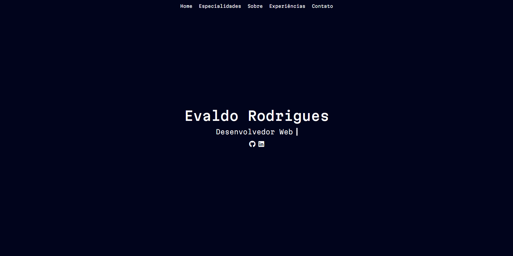
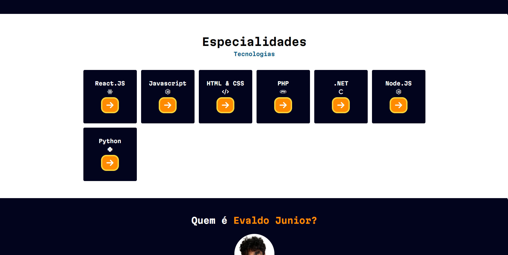

<h1>Portfólio Pessoal</h1>
<h2>O que é?</h2>

Um website em que posso mostrar ao mundo um pouco sobre o meu pessoal e profissional, deixando visível aqui as tecnologias em que me sinto a vontade utilizando e projetos que já desenvolvi com cada uma delas.

<h2>Para que foi feito?</h2>

Criei esse projeto com intuito de expor um pouco sobre mim e todos os meus outros projetos que já construí ao mundo. Por quê não fazer isso em uma das minhas especialidades também, a criação de sites?

<h2>Como acessar?</h2>

O portfólio está disponível em: https://portfolio-ac2xjbxyc-evaaldos-projects.vercel.app/

<h2>Imagens</h2>

